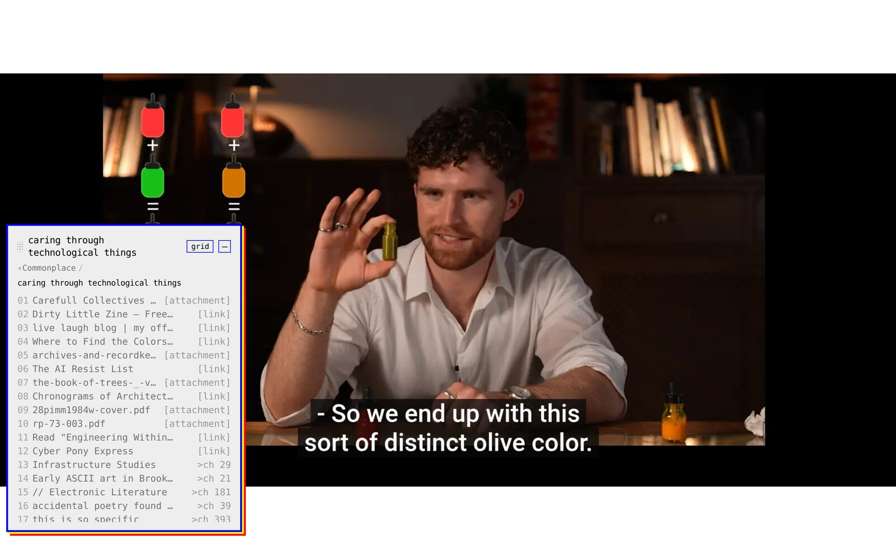
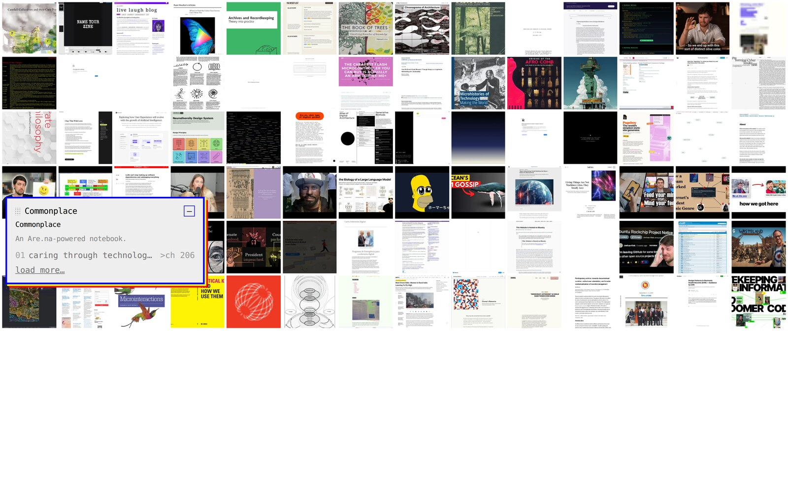
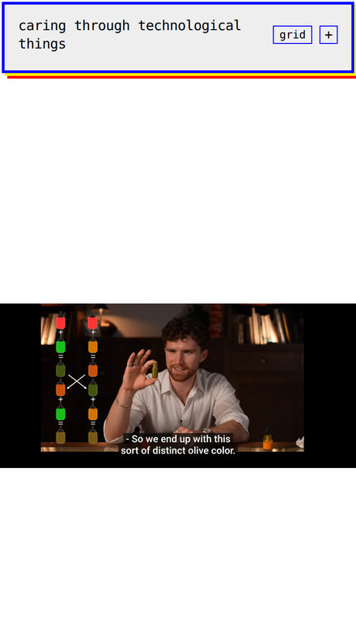

# Commonplace

**Turn any public Are.na channel into a self-hostable, browsable notebook** — a floating,
draggable menu over a full-viewport reader, shipped as 100% static files with no backend and
no secrets.

[**Live demo →**](https://micahchoo.github.io/commonplace/) · [Quickstart](#quickstart) · [Configuration](#configuration) · [Deploy](#deploy)



Point it at a channel and browse its blocks — images, text, links, embeds, PDFs, and nested
channels — each rendered in place. It's a modern rebuild of
[Binder](https://github.com/clementvalla/binder): the same signature look (the double-shadow
monospace box), but content now comes from Are.na at runtime instead of a hand-edited link
list, and the stack is Svelte 5 + Vite with no jQuery.

Named for the [commonplace book](https://en.wikipedia.org/wiki/Commonplace_book) — a personal
book of collected quotes and clippings, which is essentially what an Are.na channel is.

## Features

- **Runtime, not build-time.** Edit `config.json`, reload — no rebuild to change what it shows.
- **Every block type rendered in place** — images, sanitized text, sandboxed embeds, inline
  PDFs, framed links, and nested-channel drill-down with a connections strip.
- **Contact-sheet grid view** — see a whole channel as a wall of thumbnails; click one to open it.
- **Deep-linkable** — the URL hash encodes the drill path and the open block, so every view is
  shareable and the back button behaves.
- **Signature draggable UI** — the floating monospace box with its yellow/red double shadow;
  collapses to a pinned bar on mobile.
- **100% static & self-hostable** — deploy the `dist/` folder anywhere. No server, no auth
  tokens, no secrets (a static build can't hold one).

## Quickstart

```bash
git clone https://github.com/micahchoo/commonplace.git
cd commonplace
npm install
npm run dev          # → http://localhost:5173
```

It boots on the sample channel in `public/config.json`. Point it at your own by editing that
file (see [Configuration](#configuration)) — or skip config entirely and pass a channel in the URL:

```
http://localhost:5173/?channel=your-channel-slug
```

Only **public** channels work (marked *public* or *closed* on Are.na — not *private*). There
are no auth tokens: a static deploy can't keep a secret.

## How it works

<table>
<tr>
<td width="62%"></td>
<td width="38%"></td>
</tr>
</table>

- The site's **sections** are the channels you configure. Each is a numbered index of its
  blocks; a nested channel shows up as a `>ch N` drill node, and a connections strip offers
  sideways jumps to related channels.
- **Selecting a block** renders it in the full-viewport pane by type: `` for images,
  sanitized HTML for text, a sandboxed embed for media, an inline viewer / download for PDFs,
  and an iframe for links.
- The **home view** and the per-channel **grid toggle** show a contact sheet of thumbnails —
  click any tile to open that block.
- Some sites refuse to be framed (NYT, X, GitHub, …). Those show a preview card with an
  **"open in new tab ▸"** link instead of a blank frame; every link view keeps that escape hatch.

## Configuration

Drop a `config.json` next to `index.html` (it's fetched at runtime, so no rebuild is needed):

```json
{
  "title": "My Notebook",
  "about": "A little collection.",
  "logo": "logo.png",
  "channels": ["reading-room", "field-work"],
  "theme": {
    "panel-bg": "#eee",
    "border": "blue",
    "shadow-1": "#fefb00",
    "shadow-2": "#ff0000",
    "font": "monospace",
    "text": "#717171",
    "accent": "#000"
  }
}
```

| Field | Required | Notes |
|---|---|---|
| `channels` | **yes** | Ordered Are.na channel slugs = the site's top-level sections. Full `are.na/…/slug` URLs also accepted. |
| `title` | no | Panel header + browser tab title. |
| `about` | no | Folded into the panel header. |
| `logo` | no | Small mark in the header. |
| `theme` | no | Overrides the signature look; omit for the classic Binder style. |

**Zero-config mode:** skip `config.json` and open the built app with a URL parameter —
`?channel=reading-room` or `?channels=a,b,c`. Handy for a hosted build anyone can point at
their own channel. This sets **only the channels**; `title`, `about`, `logo`, and `theme` come
from `config.json`, so a params-only load uses the default look with the channels' own titles.

**Open a channel on the fly:** paste any Are.na channel link (or bare slug) into the menu's
*"open an are.na channel…"* box to browse it immediately — no config edit, no reload. It's added
for the session; list it in `config.json` to keep it.

<details>
<summary>Migrating from Binder</summary>

Binder's `info.json` listed a `menu` of name → URL. Commonplace sources content from Are.na
instead, so the model shifts from "arbitrary links" to "channels of blocks":

1. Create an Are.na channel (make it public).
2. Add your links, images, and notes to it as blocks — each old menu URL becomes a Link block.
3. List the channel slug(s) in `config.json` under `channels`. Several old sections → several channels.

`title` / `about` / `logo` carry over unchanged; `menu` has no direct equivalent — that's the
point of the rebuild.

</details>

## Deploy

`npm run build` emits a static `dist/` — `index.html` plus hashed JS/CSS. Because
`vite.config.js` sets `base: './'`, asset paths are relative and the app works under any subpath.

- **GitHub Pages.** This repo ships a workflow ([`.github/workflows/deploy.yml`](.github/workflows/deploy.yml))
  that builds and deploys on every push to `master`. Fork it, enable Pages (source: GitHub
  Actions), and your notebook is live at `https://<you>.github.io/<repo>/`.
- **Netlify / Vercel / S3 / nginx.** Serve `dist/` as static files.

```bash
npm run build        # → dist/
npm run preview      # serve the production build locally to smoke-test
```

> [!NOTE]
> Unauthenticated Are.na access is **30 requests/minute** (guest tier). Commonplace stays
> within it by caching channels in-session, paginating lazily ("load more"), and backing off
> on `429`. Heavy, rapid drilling can still hit the ceiling; it recovers on its own.

## Development

```bash
npm test             # unit + component tests (Vitest + jsdom)
npm run check        # svelte-check
```

- **Stack:** Svelte 5 (runes) + Vite, DOMPurify for text sanitization, native Pointer Events
  for the draggable panel.
- **Architecture & decisions:** [`docs/design/`](docs/design/). The Are.na V3 field map is in
  [`docs/research/arena-v3-field-confirmation.md`](docs/research/arena-v3-field-confirmation.md).
- **Contributing:** see [CONTRIBUTING.md](CONTRIBUTING.md).

## A note on the name

Commonplace is an **independent** Are.na browser. It is not affiliated with, endorsed by, or
sponsored by Are.na — it just uses their public API. "Are.na" is a trademark of its owners.

## Credits & license

A rebuild of [Binder](https://github.com/clementvalla/binder) by Clement Valla. Inherits the
upstream project's license.
